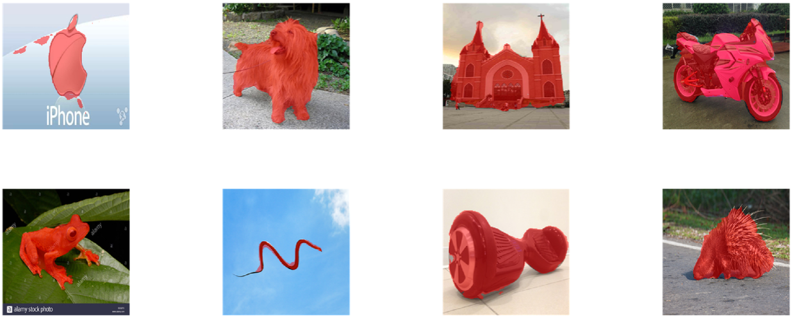
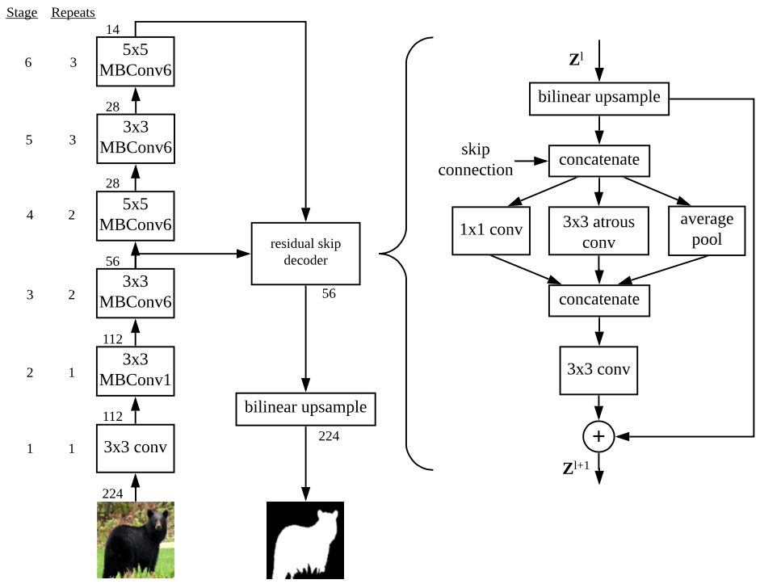

# Meta-Learning Initializations for Image Segmentation

Note that this repository is in archival status. Code is provided as-is and no updates are expected.


Code for meta-learning and evaluating initializations for image segmentation as described in our paper <https://arxiv.org/abs/1912.06290>, which was [presented at the 4th Workshop on Meta-Learning at NeurIPS 2020](https://meta-learn.github.io/2020/papers/44_paper.pdf). 

Example 5 shot predictions on test samples from meta-test tasks:




## Citing
If you find this project useful in your research, please consider citing:

```
@article{hendryx2019meta,
  title={Meta-Learning Initializations for Image Segmentation},
  author={Hendryx, Sean M and Leach, Andrew B and Hein, Paul D and Morrison, Clayton T},
  journal={4th Workshop on Meta-Learning at NeurIPS 2020},
  year={2020},
}
```

## Setup


We have included a `requirements.txt` file with dependencies. You can also see `make_python_virtualenv.sh` for recommended steps for setting up your environment.

You can download the FSS-1000 meta-training and evaluation tfrecord shards from:
https://drive.google.com/open?id=1aGHP0ev_1eAFSnYtN0ObDI-DnB0TsQUU


And the joint-training shards from:
https://drive.google.com/open?id=1aQpyQ0CEBCL9EW8xoCaI6xveYxtXNYKq

The FP-k dataset shards are available at:
https://drive.google.com/open?id=1G1NJIyQlkxAb4vlsRDPR3W3If_RJ4rPd

The FP-k dataset is derived from the [FSS-1000](https://github.com/HKUSTCV/FSS-1000) and PASCAL-5i datasets. PASCAL-5i was in turn derived from the parent datasets: [PASCAL](http://host.robots.ox.ac.uk/pascal/VOC/) and [Semantic Boundaries Datasets](http://home.bharathh.info/pubs/codes/SBD/download.html) as described in [One-Shot Learning for Semantic Segmentation
](https://arxiv.org/abs/1709.03410).

We created our meta-training tfrecord shards by following these steps.
Download the FSS-1000 dataset from https://github.com/HKUSTCV/FSS-1000
Convert the images and masks to tfrecords:
```
python fss_1000_image_to_tfrecord.py --input_dir <path to images and masks> --tfrecord_dir <directory to write tfrecords in>
```

## Run the SOTA evaluation

Extract the checkpoint:
```
tar -xzvf EfficientLab-6-3_FOMAML-star_checkpoint.tar.gz
```

Put the FSS-1000 meta-training and evaluation tfrecord shards at the root of this repo or edit the `data_dir` path in `run.sh` to point to the shards on your machine.

Finally, call:
```
./run.sh
```

## Run an experiment

The main point of entry in this codebase is:
```
python run_metasegnet.py <args>
```

See args.py for arguments and their descriptions.

Our SOTA meta-learned initialization that generated the best FSS-1000 results reported in our paper is in this repository at `EfficientLab-6-3_FOMAML-star_checkpoint`

## Visualize predictions
To see predictions, set the environment variable ala:

```
export SAVE_PREDICTIONS=1
```

## Save an adapted model
To save the weights of an updated model on your task(s), run:
```
python run_metasegnet.py --save_fine_tuned_checkpoints --save_fine_tuned_checkpoints_dir /path/to/save/to <--other_args>
```
See `run.sh` for our recommended hyperparameters found via update hyperparameter optimization.

## EfficientLab
Our SOTA network architecture class is defined in `models/efficientlab.py`.




## Acknowledgements
This repository builds on the [Reptile implementation by OpenAI](https://github.com/openai/supervised-reptile) and the [EfficientNet backbone implementation by Google](https://github.com/tensorflow/tpu/tree/master/models/official/efficientnet).
